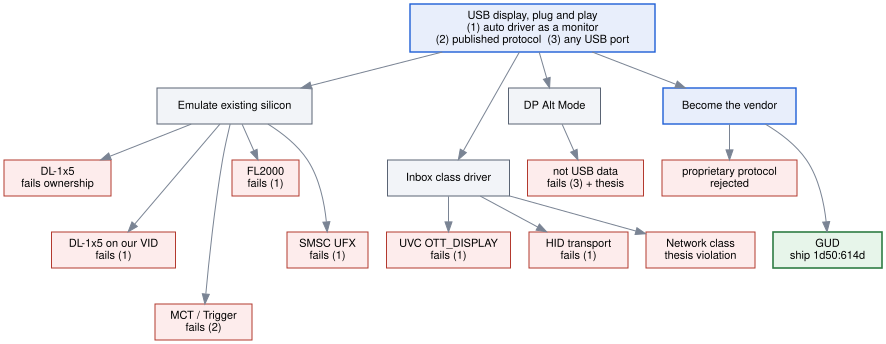

# GUD-SS - Sink Board

Fully open USB-C SuperSpeed (USB 3.2 Gen 1, 5 Gbps) device that receives
framebuffer pixels as USB bulk data speaking the GUD protocol

- **Linux hosts:** in-tree `gud` driver, out of the box support
- **Windows hosts:** our own open source GUD IddCx driver

## GUD Choice

Every path has to satisfy three requirements:
1. the OS treats it as a monitor with no user-installed software
2. the protocol is implementable from published sources
3. it works on any USB port (USB-A, 2.0 hubs, KVMs)

The reasoning behind each leaf:

- **DL-1x5** -- published protocol + live Windows Update (WU) driver;
  bench-proved that WU targeting per hardware ID works (Microsoft offered
  DisplayLink 11.7 to our emulated device unprompted). The VID `17e9`
  belongs to DisplayLink though so it can only ever be used for spoof tests
- **DL-1x5 on our VID** -- `udl` only matches DisplayLink's VID and WU
  targets their hardware IDs, so no driver ever binds
- **MCT / Trigger** -- the biggest WU presence of the bunch (845 live
  packages) but the protocol is closed
- **FL2000** -- Linux driver is open but the Windows WU package is closed
  and stale (2022)
- **SMSC UFX** -- published protocol but dead on Windows since 2013
- **UVC OTT_DISPLAY** -- the spec defines a display output terminal but no
  OS implements the sink side (Code 10)
- **HID transport** -- has an inbox driver everywhere but the OS will never
  treat it as a monitor, you need a host app
- **Network class (NCM/RNDIS)** -- passes (1)(2) literally but rejected as
  pixels over IP which is not in scope
- **DP Alt Mode** -- not technically USB data since the GPU drives it
  natively. Also needs an Alt Mode capable port so it soft fails (3)
  (see Model 03)
- **Proprietary protocol** -- we would write and maintain a Linux driver
  forever, GUD's is in-tree for free
- **GUD (winner)** -- published already on Linux, (1) still needs WU
  publishing

## SuperSpeed Gen1 over Gen2

Our testing on Pi's (DL-165 emulation on the 0w2, mirroring a live 1280x720
desktop) peaked at ~8.8 MiB/s over the wire with RLE doing ~6.3x, so ~55
MiB/s of decoded pixels -- which works out to roughly 30 full frames a
second at 720p. That was one desktop's demand while dragging windows
around. No real USB2 bench was ran so these are just figures collected
during one sitting. USB2 spec online shows ~35-40 MB/s ceiling and 1080p60
needs 249+ MB/s so that's the reason for SuperSpeed. AltMode could also
solve the bandwidth problem since it rides the same connector but it's more
moving parts (see Model 03 for that research). Gen1 covers all the target
modes -- Gen2 would add additional PHY costs and would need signal
integrity considerations like trace lengths and the like

## Bandwidth & memory research

| Stream | Rate | Fits? |
|---|---|---|
| 1080p60 RGB565, full frames | 249 MB/s | yes -- the headline sustained mode |
| 1080p60 RGB888, full frames | 373 MB/s | marginal -- at the FX3 ceiling; damage-driven yes |
| 1080p60 XRGB8888, full frames | 498 MB/s | no -- needs damage rects or LZ4 (future block) |
| 720p60 XRGB8888, full frames | 221 MB/s | yes |

The per-stream rows are just arithmetic (w x h x bpp x fps). Damage rects
in the table means GUD only ships the rectangles that changed instead of
full frames, so the full frame rows are worst case numbers. FX3 sustained
bulk is supposedly ~340-380 MB/s going off Cypress's app note and what other
people report (not tested personally). Their own charts show it varies by
host machine and transfer size, which aligns with the Pi tests where read
size alone moved throughput several x. DDR worst case (ingress + scanout) is
~750 MB/s against maybe ~960 MB/s usable from a single x16 DDR3L-800,
assuming the 60% efficiency rule of thumb holds for our burst patterns
(won't know until LiteDRAM is up). Should fit with margin. The only number
here from personal testing is the USB2 ceiling and even that was limited.
None of these numbers are real until the roadpath item 3 loopback test. If
that comes back under 300 MB/s then 1080p60 RGB888 is probably out and the
target modes will need to be reevaluated (maybe RGB565 only...)

## Must Haves (all models)

- USB 2 fallback
    Most of the Pi testing happened at USB2 and hosts need to get a working
    display on any port
- Bus-powered
    900 mA @ 5 V SS budget, board lands ~3.8 W worst case without a panel --
    that's summed datasheet typicals though, not a metered board (ECP5 draw
    is design dependent so it could move either way, the per-rail shunts are
    there to find out). Panel/backlight powered peripherals need external
    power in this configuration
- Single x16 DDR3L-800
    Bandwidth math above, the 4 Gbit part is commodity and LiteDRAM already
    supports it
- HDMI via `ADV7513`, not FPGA-direct TMDS
    1080p60 needs a 148.5 MHz pixel clock. ADV7513 is rated 165 MHz per the
    datasheet and only needs I2C setup, direct TMDS from ECP5 fabric at
    that rate looks marginal (not tested personally)

## Model 01: FX3 terminates USB 3

ECP5 + open toolchain?
    Yosys/nextpnr/LiteX/LiteDRAM are all mature on ECP5 and it keeps the
    gateware as open as the drivers

Why not USB3380?
    It's a PCIe-endpoint-to-USB3 bridge so it needs a PCIe root complex
    behind it. That was the Pi 5 track, a standalone board has no PCIe host

### MUST HAVES

- No SerDes
    LFE5U base is all that's needed from the fpga

### Component Choices

- Cypress/Infineon FX3 (`CYUSB3014`) terminates USB
    Proven device side USB3 silicon so the hardest bring up risk is not
    ours. GPIF II (the FX3's 32-bit parallel FIFO port) gives 3.2 Gbps into
    the FPGA (spec number, see bandwidth section)
- SS PHY, link layer, endpoints, enumeration, and USB2 fallback
    All handled inside the FX3
- Lattice ECP5 (`LFE5U-45F`, 0.8 mm BGA)
    Should be big enough for the blit engine + scanout + soft RISC-V and a
    future LZ4 block (45F vs 85F is a guess until the gateware is sized),
    open toolchain, cheap

## Model 02: FPGA-native USB 3 (more research)

### MUST HAVES

- A 5 Gbps PHY from somewhere
    The FPGA terminates USB3 itself in this model, so either the UM5G's
    SerDes or an external PIPE PHY (the two component choices below)

### Component Choices

- `ECP5UM5G-45`
    5 Gbps SerDes + LiteX `usb3_pipe` -- reportedly enumerated on bench
    boards (going off their repo and demos, not reproduced personally) and
    never shipped in a product from what I can tell. Research milestone for
    now
- External PIPE PHY (`TUSB1310A`)
    PHY handles the 5 Gbps signaling and the FPGA speaks 16/32-bit PIPE.
    More parts and board area but the hard analog part moves into known
    silicon

## Open Questions

- Blit engine: streaming line-blitter (mirrors `gud-sink`'s loop) vs command
  queue DMA?
- Buffer flip: on STATE_COMMIT only, or per-SET_BUFFER with tear tracking?
  Test on the Pi first
- GPIF framing: raw stream with SPI-armed rects, or in-band headers? Decide
  before the register map freezes
- Storage format: convert on blit (always XRGB) vs convert on scanout (wire
  format)? Run against the bandwidth table
- Model 02: reserve PIPE PHY provisioning on this board or a separate spin?
  (probably separate spin with shared gateware but idk yet)
- EDID: always serve the flash identity, or pass through an attached panel's
  EDID?

## Model 03: DP AltMode (even more research...)

- Alt Mode entry is negotiated over USB-PD structured VDMs (Discover
  Identity/SVIDs/Modes, Enter Mode, HPD messaging). The simple CC chip
  (`HD3SS3220`) would have to become a full PD sink controller (`TPS65988`
  / CCG class) and the PD firmware alone looks comparable to the whole FX3
  firmware effort
- Lane routing needs a crosspoint mux (`HD3SS460` class) instead of the
  flip mux, steered by the PD controller
- DP receive: either a closed DP-to-LVDS/RGB bridge chip (same closed
  silicon tradeoff as the FX3) or FPGA-native DP RX which needs >=2.7
  Gbps/lane transceivers and an open DP receiver core (couldn't find one
  that exists). FPGA-native RX would be its own research as well
- AUX plumbing: DP's AUX channel rides the USB-C SBU pins, new routing that
  ends at the DP receiver. It also serves a second EDID over AUX that has
  to stay consistent with the GUD mode list
- Source arbitration: two video producers (DP RX and GUD scanout) into one
  panel. Either a pixel mux or ingest DP into the FPGA as a second source
  (which would also let the board capture/record its DP input)[untested though]
- Pin assignment D carries 2-lane DP + USB3 Gen1 at the same time so a dual
  identity board is possible. Tabled for now since none of it moves the
  core goal forward, rev A just routes SBU and reserves the PD/mux
  footprints

## Debug & bench features

- FTDI USB-UART
    Soft-CPU console + the same 2 s stats line from the Pi sinks, that
    logging is what got us through the DL-165 debugging
- JTAG headers for both ECP5 and FX3
    Iterate gateware and firmware independently
- FX3 boot-mode strap
    USB boot so firmware mistakes can't brick it
- Test points/pin header on 8 GPIF signals + ingress FIFO levels
    If throughput comes up short this is the bus to scope
- Sync outputs (vsync/hsync/DE) on pins
    Scope triggering for the scanout half
- Built-in test-pattern generator
    Proves scanout/output with no host attached, same idea as `modetest`
- CSI-2 TX provisioning
    Footprints only: reserved I/O bank + 22-pin FFC for 2-lane emulated
    D-PHY so a Pi can ingest the framebuffer via its camera port (V4L2).
    Until populated, HDMI -> TC358743 does the same with zero gateware
- LED bank
- Test pinout + 0 ohm shunt footprint for every power rail
- SPI flash dual-image with golden fallback bitstream

## Roadpath and Targets

1. Power, JTAG, blinky, DDR calibration passes, test pattern on HDMI (board
   + scanout half, no host needed)
2. FX3 enumerates SS with GUD descriptors, `lsusb` clean on Linux + Windows
    - Enumerate SS on Linux, `gud` binds, connector + modes correct
3. Bulk loopback FX3 -> FPGA -> telemetry at >= 300 MB/s (GPIF + FIFO + DDR
   write path)
    - 1080p60 RGB565 sustained full-frame updates >= 60 fps
    - Desktop mirror latency (damage in -> glass) < 1 frame + scanout
4. `gud_host.py --test-pattern` renders correctly via full GUD path (control
   plane + blit engine, existing tools)
    - 720p60 XRGB8888 sustained >= 60 fps
5. Linux `gud` driver extends a desktop, recording + stats match the Pi sink
   format
    - USB2 fallback: 800x480 desktop usable >= 15 fps
    - 1080p60 XRGB8888 on a typical desktop (damage driven), judged during
      testing
6. GUD IddCx driver drives it on Windows, the driver this board exists for
    - Windows IddCx driver end to end on this board
